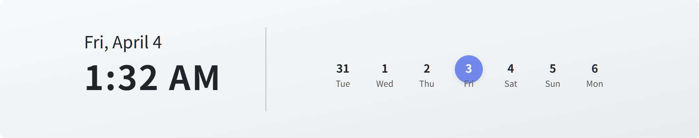
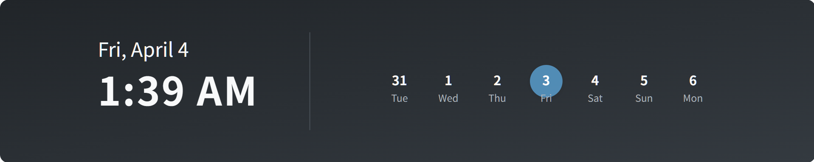

# 🗓️ Notion Header Calendar

<div align="center">
  
  
  
  
  
</div>

<div align="center">
  <p><strong>動的に生成されるエレガントなSVGカレンダーをNotionヘッダーに埋め込もう</strong></p>
  <p>レスポンシブデザイン | ダークモード対応 | タイムゾーン自動検出</p>
</div>

<div align="center">
  
  
</div>

## ✨ 特徴

- **リアルタイム更新**: 現在の日付、時間、1週間のカレンダーを動的に表示
- **レスポンシブデザイン**: サイズが動的に変更されても表示崩れを起こさない
- **ダークモード対応**: `?theme=dark` パラメータで切り替え可能
- **タイムゾーン自動検出**: ユーザーの現在地に合わせた時間表示
- **カスタマイズ可能**: クエリパラメータで様々な設定を変更可能
- **Cloudflare Workers対応**: エッジで高速に動作

## 🚀 デモ

- [ライトモード](https://notion-header.ayutaso.com/svg?tz=Asia/Tokyo)
- [ダークモード](https://notion-header.ayutaso.com/svg?tz=Asia/Tokyo?theme=dark)
- [カスタムタイムゾーン](https://notion-header.ayutaso.com/svg?tz=America/New_York)

## 📋 使い方

### Notionへの埋め込み

1. Notionページを開く
2. カバー画像を変更
3. 「URL リンク」を選択
4. デプロイしたWorkerのURLを入力（独自カスタムしない場合: `https://notion-header.ayutaso.com/svg`）
5. 「確定」をクリック

### カスタマイズオプション

URLクエリパラメータを使用して、SVGの表示をカスタマイズできます：

| パラメータ | 説明 | 例 |
|------------|------|-----|
| `theme` | テーマを指定（`light`または`dark`） | `?theme=dark` |
| `tz` | タイムゾーンを指定（IANA時間帯ID） | `?tz=Asia/Tokyo` |

複数のパラメータを組み合わせることも可能です：
```
https://notion-header.ayutaso.com/svg?theme=dark&tz=Europe/London
```

## 🛠️ 開発

### 前提条件

- [Node.js 22](https://nodejs.org/)
- [Wrangler CLI](https://developers.cloudflare.com/workers/wrangler/install-and-update/)

### インストール

```bash
# リポジトリをクローン
git clone https://github.com/yourusername/notion-header-calendar.git
cd notion-header-calendar

# 依存関係をインストール
pnpm install
```

### ローカル開発

```bash
# 開発サーバーを起動
pnpm run dev
```

ブラウザで [http://localhost:8787/svg](http://localhost:8787/svg) にアクセスして確認できます。

### デプロイ

```bash
# Cloudflare Workersにデプロイ
pnpm run deploy
```

## 🧩 アーキテクチャ

このプロジェクトは以下のコンポーネントで構成されています：

- **Hono**: 軽量なWebフレームワーク
- **SVG生成**: 動的なSVGを生成するモジュール
- **タイムゾーン検出**: ユーザーのタイムゾーンを自動検出する機能
- **テーマ管理**: ライトモードとダークモードの切り替え

## 📝 ライセンス

[MIT License](LICENSE)

## 🤝 貢献

貢献は大歓迎です！バグ報告、機能リクエスト、プルリクエストなど、どんな形でも構いません。

1. このリポジトリをフォーク
2. 機能ブランチを作成 (`git checkout -b amazing-feature`)
3. 変更をコミット (`git commit -m 'Add amazing feature'`)
4. ブランチをプッシュ (`git push origin amazing-feature`)
5. プルリクエストを開く

## 📬 お問い合わせ

質問や提案がある場合は、[Issues](https://github.com/yourusername/notion-header-calendar/issues) でお気軽にお問い合わせください。

---

<div align="center">
  <p>Made with ❤️ for Notion users</p>
</div>
